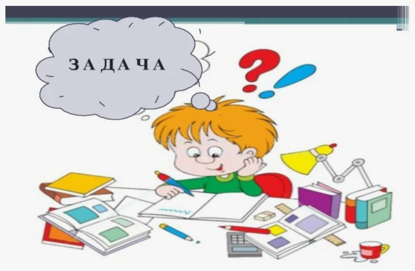

# **"Асинхронные силачи"**
___
## **Необходимо сделать имитацию соревнований по поднятию шаров Атласа.**

_**Напишите асинхронную функцию start_strongman(name, power), где name - имя силача, power - его подъёмная мощность. Реализуйте следующую логику в функции:**_

1. В начале работы должна выводиться строка - _'Силач <имя силача> начал соревнования._'
2. После должна выводиться строка - _'Силач <имя силача> поднял <номер шара>'_ с задержкой обратно пропорциональной его силе power. Для каждого участника количество шаров одинаковое - 5.
3. В конце поднятия всех шаров должна выводится строка _'Силач <имя силача> закончил соревнования.'_
4. Также напишите асинхронную функцию start_tournament, в которой создаются 3 задачи для функций start_strongman. Имена(name) и силу(power) для вызовов функции start_strongman можете выбрать самостоятельно.
5. После поставьте каждую задачу в ожидание (await).
6. Запустите асинхронную функцию start_tournament методом run.